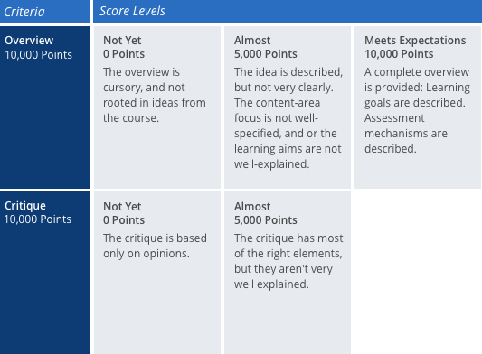

Gameful learning is a pedagogical approach that takes inspiration from how good games function, and applies that to the design of learning environments. Gameful design operates in a self-deterministic framework–we want to apply what self-determination theory says about how intrinsic motivation works to build motivating classroom experiences.

 Self-determination theory says that in order to feel intrinsically motivated, people need to be able to make meaningful choices over what they are doing (autonomy), be challenged by a task but feel like they can succeed (competency), and feel connected to those around them (belongingness). How do we establish support for these feelings? And which elements from games do we use to do so? We start with an perspective switch: we switch from a percentage system where students begin with 100% and lose as they complete assessments, to one where they start with zero points and earn up as they complete experiences and show content mastery.

## Choice
In order to support autonomy, students need to have some control over their learning environment, but there’s a lot still to be understood about what kinds of choices they need to be able to make, and how many options they need to feel in control. Our current rule of thumb is that students need to make decisions regarding how they’ll earn approximately 50% of the points they need to get an A.

If you establish a design where students need to earn 12000 points to get an A, then 6000 might come from assignments you ask everyone to complete (Reading reactions, problem sets, lab reports, etc), and 6000 should come from assignments they get to choose. This could mean that you have 10 assignments and they select 5, or that you have 5 assignments, and students can decide when each will be due, what material they’ll cover, or what format they’ll complete the work in. Both of these examples provide students with autonomy over their learning.

## Start with Learning Objectives
We recommend creating your learning objectives for the course before you create assignments. Then, with the assignments in place, you should review each one and identify which of the learning objectives it maps to. If an assignment doesn’t map to any learning objective, it’s a good opportunity to consider what your goals are for including it within the course and whether there may be an additional learning objective you want to add, or possibly remove it altogether. The research around intrinsic motivation emphasizes that it’s motivating for students to understand the value of the work they’re doing - what they’re supposed to get out of it, and why you think it’s an important task. Starting your course design with learning objectives is a fantastic way to help you share this information with students, as well as build assessments that ensure you’re able to track students’ overall progress towards accomplishing them.

## Feedback
One of the most engaging aspects of videogames is the way you get immediate feedback in response to your actions. We aim to provide students with feedback as descriptive as what they experience in videogames, while acknowledging that many forms of assessment don’t lend themselves to instant feedback or assessment. We encourage instructors to get feedback to students as quickly as possible, and are working to provide a variety of tools within GradeCraft to support this.

One way we’re finding that provides faster feedback is using rubrics: you spend more time setting the assignment up, but then are able to assess and provide feedback on student submissions a more rapid and consistent manner. The detailed assessment information present in a good rubric means that students generally tell us that they’ve gotten better feedback, despite their instructors having spent less time grading per assignment and writing shorter comments. Other ways to provide rapid feedback at scale include auto-graded quizzes and peer-feedback.

## Freedom to fail
A core principle in videogames is the freedom to fail: you can experiment, take risks and try things you have never done before, fail miserably...and do it again and again until, after much practice, you get it right. Infinite practice won’t work in all classroom contexts - it requires a significant amount of grading to manage, and it can hinder the ability to keep a cohort on a specific content progression. But when you can structure learning opportunities in this way we see students’ motivation to engage increase, and their learning outcomes improve. Consider these different ways to incorporate the freedom to failure into your course design:

  -  Allow students to re-submit an assignment multiple times
  -  Allow students to re-submit an assignment if it is below particular threshold (thereby limiting the amount of re-grading necessary)
  -  Structure multiple ‘pathways’ of assessments so that failure in one area does not limit a student’s course success. For instance, if a student does poorly on an essay, they can make up for it by writing multiple scholarly blog posts.

> This is a block-quote. Testing, testing, testing. Blah blah blah blah blah blah blah blah

## Transparency
In order for students to have the autonomy to decide what assignments they will work on and plan their schedule for the semester it’s essential to be transparent about the opportunities they will have during the semester.We encourage instructors to have all of their assignments designed and ready to go right from the beginning, complete with rubrics and/or grading schemes, and how completing different assignments at different thresholds maps to different outcomes in the course. If you don’t tell students what point thresholds and/or achievements equate to each grade, they can’t make informed choices about what work they’ll take on.

We also set the expectation that, as part of being transparent, you will not use a grading curve. Whatever points a student earns maps directly to the grade they’ll get; if they earn enough points to have achieved an A three quarters of the way through the class, then they’ve earned an A at the end of the semester. We encourage you to share data with students directly regarding their progress as compared to their peers in order to help them reflect on both their effort and progress, and to encourage them to reach out for support if they’re falling behind. We have consistently seen if if you set a high bar with transparent components, students are motivated to succeed and will do high-quality work to do so.
